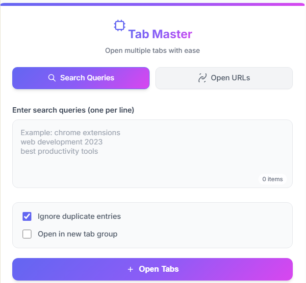

# Tab Master Chrome Extension



## 🔥 Features

### 🚀 Bulk Tab Management
- Open multiple Google searches or URLs simultaneously
- Supports both keywords (converted to Google searches) and direct URLs
- One entry per line formatting

### � Smart Deduplication
- Optional duplicate prevention
- URL normalization (ignores `www`, protocols, trailing slashes)
- Case-insensitive keyword comparison

### 🗂️ Organized Workspace
- Optional tab group creation
- Automatic group naming based on content
- Color-coded groups (Chrome 89+)

### ✨ Premium UX
- Scrollable text area with dynamic counter
- Real-time validation
- Auto-closing after execution
- Error prevention with clear warnings

### ⚡ Efficiency Boosters
- Lightning-fast execution
- Minimal permissions required
- Keyboard-friendly controls

## 🎯 Perfect For

| Use Case | Example |
|----------|---------|
| Research | Compare multiple topics side-by-side |
| SEO Analysis | Check competitor websites |
| Daily Workflow | Open all daily tools with one click |
| Shopping | Compare products across stores |

## 🛠️ Installation

### Chrome Web Store
1. Visit [Tab Master on Chrome Web Store](#)
2. Click "Add to Chrome"

### Manual Load
1. Download the `dist.zip` from Releases
2. Unzip and go to `chrome://extensions`
3. Enable Developer Mode
4. Click "Load unpacked" and select folder

## 🚦 Usage

```text
1. Select mode: [Keywords] or [URLs]
2. Paste your list (one per line)
3. Set options:
   ☑ Ignore duplicates
   ☑ Create tab group
4. Click "Open Tabs"
